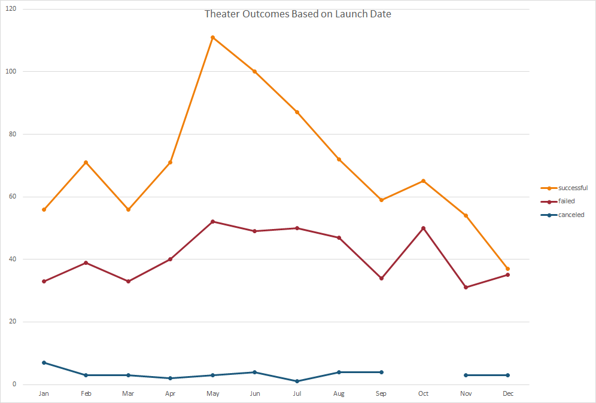
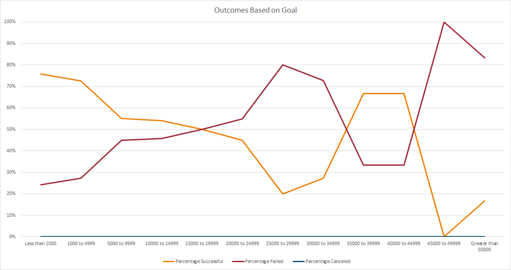

# kickstarter-analysis
Analysis of Kickstarter campaign data to uncover trends in successful funding

## Project Overview
Kickstarter campaign data from 2009 to 2017 are analyzed to determine factors for successful campaign funding of a theatrical play.  MS Excel was used to perform all data analysis and generate plots.

### Analysis and Challenges
There were 4114 campaigns analyzed from start to finish.  All unfiltered data is collected under the Kickstarter tab in the Kickstarter_Challenge.xls Excel workbook.  The data included Unix timestamps rather than standard date formats so it was necessary to convert dates into standard format before running analysis. The raw data also included a single identifier for Category and Subcategory which was unnecessarily restrictive so the Category and Subcategories were divided into separate identifiers so that we could specifically analyze data relevant to theater Category and subcategory plays.

Main Outcomes are categorized as Successful, Failed, Canceled, and Live.  Because there was so much data amassed, all “successful” outcomes are highlighted in green, “failed” outcomes in red, “canceled” in yellow, and “live” in blue for better visualization.  In order to identify any borderline campaigns that missed the goal by a small margin, a “Percentage Funded” column was added (see column "O") which is the percent the Pledged amount based on the original campaign Goal.  A color scale was applied where red represents the minimum percentage and blue represents the maximum percentage in the dataset.

This project focused on two key variables associated with successful campaign outcomes: 
1. Campaign Launch Date
2. Campaign Goals

Statistical analysis was also performed for plays in the U.S. comparing the trends for how campaign goal amounts may influence successful vs. failed campaigns. 

## Results

### Analysis of Campaign Outcomes Based on Launch Date
Kickstarter campaigns with successful, canceled and failed outcomes were analyzed for trends based on the campaign launch date.  Trends identifed with successful outcomes were analyzed for both overall US campaigns as well as specifically for the Theater category and found to have similar trends.  The campaign outcomes specifically for theater campaigns were analyzed and plotted in the following chart: Theater Outcomes Based on Launch Date
 

This plot shows that campaigns started in early summer months (May, June) correlate to more successful campaign outcomes while the month of December shows the lowest successful outcome count where the success and failure count of campaigns are nearly equal.  Data was not available for Canceled theater campaigns in the month of October.

### Analysis of Campaign Outcomes Based on Goals
In order to determine the effect of the funding goal amount on campaign success, we collected the outcome and goal data for all theater play campaigns in the Kickstarter dataset. The count of an outcome (successful, failed, or canceled) is expressed as a percentage of the total count and plotted against Goal amount which was divided into 12 groups based on value range in the following chart: Outcomes Based on Goal

This plot illustrates a negative trend for campaign goal amounts and percent of campaign successes. The highest percentage of successful campaigns and the lowest failures fall in the range less than US$5000 whereas the highest percentage of failed campaigns and lowest success (success rate actually falls to zero) above US$45,000.

Statistical analysis performed for plays in the US determined that the Median and Mean goal amount for Failed campaigns are much higher than the successful campaigns. In fact, failed campaigns are more than twice the mean for successful campaigns.  

However, the standard deviation for failed campaigns is also high indicating a larger spread for failed campaigns. The average campaign Goal amount for a successful Kickstarter campaign is around US$5,000.  While the majority of failed campaigns did average higher goal amounts, the vast majority of pledged amounts for failed campaigns were also much lower than for successful campaigns with a mean around US$559 and a median value of only US$103.  This trend indicates that the average failed campaigns were not even close to meeting the high campaign goals set.  It is recommended to increase the scope of this report to include statistical analysis on the backer count, average donation size, and what other factors may be determining low pledged amounts.

The focus of this study was for US campaigns however, a quick analysis of the Outcomes for various campaigns started within Great Britain show the "theater" category is clearly the most successful in that region.  Further analysis may be required to determine what factors make theater campaigns in Great Britain so successful however, that is outside the scope of this report.
